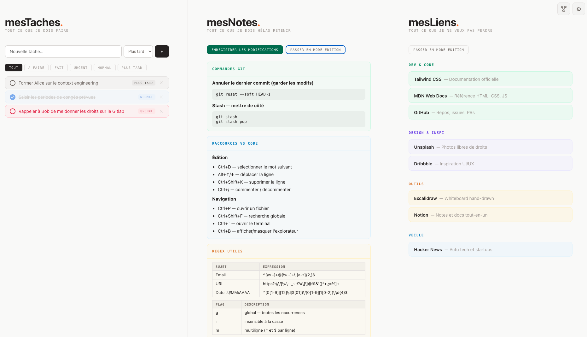

# myTasks. myNotes. myLinks.

> A three-column personal productivity dashboard — zero dependencies, zero server, zero security compromises. Available in **French** and **English**.

## Security — why this project can be used anywhere

This is one of the dashboard's greatest strengths. Here is why it poses **no risk** in a secure environment:

| Criterion        | This project                                                                  |
| ---------------- | ----------------------------------------------------------------------------- |
| Network requests | **None** — no CDN, no API, no tracking                                        |
| External deps    | **None** — plain HTML, CSS and Vanilla JavaScript only                        |
| Server required  | **No** — opens directly via `file://` in the browser                          |
| Data sent        | **Never** — everything stays on your machine (`localStorage` and local files) |
| Installation     | **None** — no executable, no package manager, no admin rights                 |
| Auditable code   | **Yes** — a handful of readable files, nothing minified or obfuscated         |

> **In practice**: you can open this on an air-gapped machine, inside a network with no internet access, or in a strict security environment (IT departments, defence, finance, healthcare…). It makes no outbound connections, loads nothing from the outside, and stores your data only where you choose.

---



## Why this project?

Some work environments are **highly restricted**: no access to the usual task-tracking tools, no CDN, no way to install anything.

Yet your productivity depends on your ability to **log your tasks**, your **notes** and your **useful links** somewhere — and find them again each morning.

This project solves that problem: a **single HTML file** you drop on your desktop that works in any browser, even offline.

---

## The three panels

### myTasks. — Task manager

Add tasks in an instant, sort them by priority, tick them off as the day goes on.

- Three priority levels: **Urgent**, **Normal**, **Later**
- Status filters: All, To do, Done, Urgent, Normal, Later
- Checkbox to mark a task as complete
- Individual deletion

### myNotes. — Structured notepad

Everything you need to remember, organised as notes made of freely stackable blocks.

- Four block types per note:
  - **Title** — short bold text to structure the note
  - **Text** — free paragraph
  - **Code** — monospace block with grey background (commands, regex, snippets…)
  - **List** — bullet points
- Each note has a customisable colour
- Add, edit and delete notes and blocks in edit mode

### myLinks. — Useful link directory

Your links organised by category, accessible in one click.

- Customisable categories with a colour of your choice
- Displayed with name and description
- Add, edit and delete in edit mode

---

## Data persistence

Everything is saved in the browser's `localStorage` — your content survives browser restarts.

To avoid losing data when you clear the cache or switch machines, each panel has a **"save changes"** button that overwrites the source file (`mesLiens.js` or `mesNotes.js`) directly on your disk, using the **File System Access API** (Chrome and Edge Chromium only).

> **First save**: a modal asks you to select the project folder. The file is then updated directly on every subsequent save, with no dialog.

## Administration page

The ⚙ icon in the top-right corner of the dashboard opens `admin.html`. It lets you:

- **Choose the language** — switch between Français and English (saved in localStorage)
- **Clear localStorage** — resets to the default data from `mesLiens.js` and `mesNotes.js` on next load
- **Delete IndexedDB** — clears the stored file handle; the next save will ask you to select the folder again

The two reset actions are independent, can be checked separately, and are executed via a single button. The page explains the consequences before acting.

## Internationalisation

The interface is available in **French** (default) and **English**. The language is chosen from the administration page and stored in `localStorage`.

Translations live in the `i18n/` folder:

| File           | Role                                                                       |
| -------------- | -------------------------------------------------------------------------- |
| `i18n/fr.js`   | French translations (`var i18n_fr`)                                        |
| `i18n/en.js`   | English translations (`var i18n_en`)                                       |
| `i18n/i18n.js` | Engine: reads `localStorage["lang"]`, exposes `window.t` and `applyI18n()` |

---

## Quick start

### Via npx (recommended)

```bash
npx doc-survival-kit
```

Creates a `doc-survival-kit/` folder in the current directory and opens the application automatically in the browser. Subsequent runs simply open the application without overwriting anything.

> Requires Node.js >= 16.7. Use Chrome or Edge for file saving.

### Without any tool

1. Copy the following files and folder into a new directory:

- `index.html`
- `admin.html`
- `liens.js`
- `mesLiens.js`
- `mesNotes.js`
- `notes.js`
- `style.css`
- `taches.js`
- `i18n/` (entire folder)

2. Open `index.html` in Chrome or Edge
3. That's it.

Sample content is already present in each panel to give you an idea of what you can put there.

### Manually

1. Clone or download this repository
2. Open `index.html` in Chrome or Edge
3. That's it.

```bash
git clone https://github.com/ymedaghri/doc-survival-kit.git
cd doc-survival-kit
open index.html   # macOS
# or
start index.html  # Windows
```

---

## Tech stack

| Technology         | Detail                                                  |
| ------------------ | ------------------------------------------------------- |
| HTML               | Semantic structure, no framework                        |
| CSS                | Separate styles in `style.css`, no framework            |
| JavaScript         | Vanilla, no third-party library                         |
| Local storage      | Browser `localStorage`                                  |
| File storage       | File System Access API (`showDirectoryPicker`)          |
| Handle persistence | `IndexedDB` — file handle is remembered across sessions |

---

## Author

**Youssef MEDAGHRI-ALAOUI**
[craftskillz.com](https://www.craftskillz.com/posts/stay-secure-and-productive)

---

## License

This project is distributed under the **MIT** licence — you are free to use, modify and redistribute it, including in commercial projects, provided you retain the original author credit.
