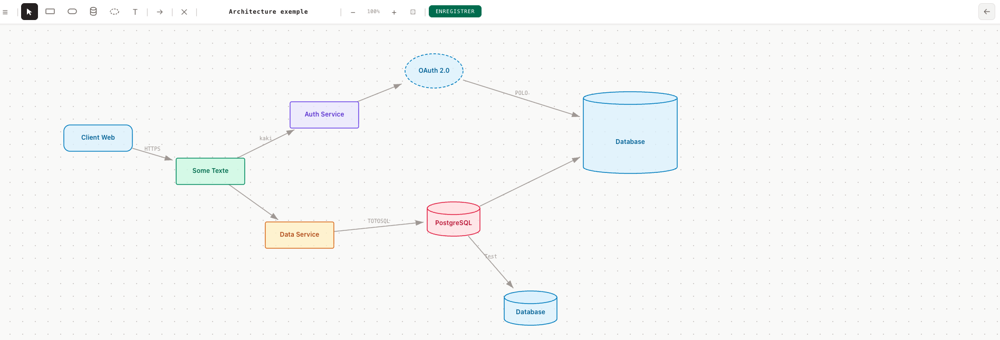

# myTasks. myNotes. myLinks. & Diagrams !

> A three-column personal productivity dashboard, and a diagramming tool with zero dependencies, zero server, zero security compromises. Available in **French** and **English**.

## Security — why this project can be used anywhere

This is one of the dashboard's greatest strengths. Here is why it poses **no risk** in a secure environment:

| Criterion        | This project                                                                  |
| ---------------- | ----------------------------------------------------------------------------- |
| Network requests | **None** — no CDN, no API, no tracking                                        |
| External deps    | **None** — plain HTML, CSS and Vanilla JavaScript only                        |
| Server required  | **No** — opens directly via `file://` in the browser                          |
| Data sent        | **Never** — everything stays on your machine (`localStorage` and local files) |
| Installation     | **None** — no executable, no package manager, no admin rights                 |
| Auditable code   | **Yes** — a handful of readable files, nothing minified or obfuscated         |

> **In practice**: you can open this on any machine without internet access, or in any environment where installing tools or reaching external services is not possible. It makes no outbound connections, loads nothing from the outside, and stores your data only where you choose.

---




## Why this project?

Some environments have **no internet access** or don't allow installing tools: no task-tracking software, no CDN, nothing from the outside.

Yet your productivity depends on your ability to **log your tasks**, your **notes** and your **useful links** somewhere — and find them again each morning.

This project solves that problem: a **single HTML file** you drop on your desktop that works in any browser, even offline.

---

## The three panels

### myTasks. — Task manager

Add tasks in an instant, sort them by priority, tick them off as the day goes on.

- Three priority levels: **Urgent**, **Normal**, **Later**
- Status filters: All, To do, Done, Urgent, Normal, Later
- Checkbox to mark a task as complete
- Individual deletion

### myNotes. — Structured notepad

Everything you need to remember, organised as notes made of freely stackable blocks.

- Five block types per note:
  - **Title** — short bold text to structure the note
  - **Text** — free paragraph
  - **Code** — monospace block with grey background (commands, regex, snippets…)
  - **List** — bullet points
  - **Table** — columns separated by `|`, first line = headers
- Each note has a customisable colour
- Notes are **collapsed by default** — click the chevron to expand; use the toolbar button to expand/collapse all at once
- Add, edit and delete notes and blocks in edit mode

### myLinks. — Useful link directory

Your links organised by category, accessible in one click.

- Customisable categories with a colour of your choice
- Categories are **collapsed by default** — click the chevron to expand; use the toolbar button to expand/collapse all at once
- Displayed with name and description
- Add, edit and delete in edit mode

### myDiagrams. — Diagram editor

A lightweight SVG diagram editor accessible via the diagram icon (top-right of the dashboard).


#### Shapes

Six shape types are available from the toolbar:

| Shape             | Description                                               |
| ----------------- | --------------------------------------------------------- |
| Rectangle         | Standard box with slightly rounded corners                |
| Rounded rectangle | Pill-shaped box                                           |
| Database          | Cylinder — represents a data store                        |
| External service  | Solid ellipse — represents a third-party or cloud service |
| Free text         | Label without a background                                |
| Post-it           | Sticky note with a folded corner, multi-line text         |

#### Arrows

- Draw arrows by clicking **source → target** with the arrow tool, or by **dragging from a connection dot** on any shape
- The label input opens automatically after creating an arrow
- **Double-click** an arrow (or use the ✎ button) to edit its label

#### Text editing

- **Double-click** a shape (or use the ✎ button) to edit its text inline
- For `rect`, `rounded`, `db`, `cloud` and `postit` shapes, a **transparent textarea** is overlaid directly on the shape — text wraps automatically as you type
- The text input for the `db` cylinder is positioned in the **body only**, below the top cap

#### Text formatting palette

When a shape is selected, a formatting palette appears. From left to right:

| Control       | Effect                                                                                             |
| ------------- | -------------------------------------------------------------------------------------------------- |
| 6 colour dots | Apply a theme colour to the shape                                                                  |
| ✎             | Open the inline text editor                                                                        |
| `Aa+` / `Aa−` | Increase / decrease font size (range: 8–28 px)                                                     |
| ← / ↔ / →     | Horizontal text alignment: left / centre / right                                                   |
| ↑ / ↕ / ↓     | Vertical text alignment: top / middle / bottom                                                     |
| Hollow drop   | Copy the **font size** from another shape — click the button then click the source shape           |
| Filled drop   | Copy the **full style** from another shape (font size, colour, shape type, dimensions, alignments) |

> The style copy (filled drop) works with multi-selection: select several shapes, activate the drop, click the source — all selected shapes are updated at once.

#### Text wrapping

Text in `rect`, `rounded`, `db`, `cloud` and `postit` shapes wraps automatically to fit the shape width. Resizing a shape immediately re-flows the text. The font size set via `Aa+`/`Aa−` is also taken into account when computing line breaks.

#### Zoom per diagram

Each diagram remembers its own zoom level. Switching from one diagram to another restores the zoom you were using last time — stored in `localStorage` separately from the diagram data.

#### Lock per diagram

The lock button (🔓/🔒) in the toolbar freezes the diagram: all canvas interactions (selection, tools, keyboard shortcuts) are disabled and any click simply pans the view. The lock state is saved per diagram in `localStorage` and restored when you switch back to it.

#### Navigation

- The ☰ button opens the diagram list panel — clicking a diagram name switches to it **and closes the panel automatically**
- Diagram names **wrap to the next line** if they are too long — nothing is truncated
- Diagrams can be **reordered by drag & drop** in the panel: grab the `⠿` handle on the left of any item, drag it up or down, and a dashed orange line shows exactly where it will land
- The `+ New` button creates a new diagram
- The ← button in the top-right returns to the main dashboard

#### Saving

- Saves directly to `diagrammes.js` on disk via the File System Access API (same mechanism as notes and links)
- The green **save** button appears in the toolbar whenever the in-memory data differs from the saved file

---

## Data persistence

Everything is saved in the browser's `localStorage` — your content survives browser restarts.

To avoid losing data when you clear the cache or switch machines, each panel has a **"save changes"** button that overwrites the source file (`mesLiens.js` or `mesNotes.js`) directly on your disk, using the **File System Access API** (Chrome and Edge Chromium only).

> **First save**: a modal asks you to select the project folder. The file is then updated directly on every subsequent save, with no dialog.

## Administration page

The ⚙ icon in the top-right corner of the dashboard opens `admin.html`. It lets you:

- **Choose the language** — switch between Français and English (saved in localStorage)
- **Clear localStorage** — resets to the default data from `mesLiens.js` and `mesNotes.js` on next load
- **Delete IndexedDB** — clears the stored file handle; the next save will ask you to select the folder again

The two reset actions are independent, can be checked separately, and are executed via a single button. The page explains the consequences before acting.

## Internationalisation

The interface is available in **French** (default) and **English**. The language is chosen from the administration page and stored in `localStorage`.

Translations live in the `i18n/` folder:

| File           | Role                                                                       |
| -------------- | -------------------------------------------------------------------------- |
| `i18n/fr.js`   | French translations (`var i18n_fr`)                                        |
| `i18n/en.js`   | English translations (`var i18n_en`)                                       |
| `i18n/i18n.js` | Engine: reads `localStorage["lang"]`, exposes `window.t` and `applyI18n()` |

---

## Quick start

### Via npx (recommended)

```bash
npx doc-survival-kit
```

Creates a `doc-survival-kit/` folder in the current directory and opens the application automatically in the browser. Subsequent runs simply open the application without overwriting anything.

> Requires Node.js >= 16.7. Use Chrome or Edge for file saving.

### Without any tool

1. Copy the following files and folder into a new directory:

- `index.html`
- `admin.html`
- `diagram.html`
- `diagram.js`
- `diagrammes.js`
- `liens.js`
- `mesLiens.js`
- `mesNotes.js`
- `notes.js`
- `style.css`
- `taches.js`
- `i18n/` (entire folder)

2. Open `index.html` in Chrome or Edge
3. That's it.

Sample content is already present in each panel to give you an idea of what you can put there.

### Manually

1. Clone or download this repository
2. Open `index.html` in Chrome or Edge
3. That's it.

```bash
git clone https://github.com/ymedaghri/doc-survival-kit.git
cd doc-survival-kit
open index.html   # macOS
# or
start index.html  # Windows
```

---

## Publishing to npm

Publishing is fully automated via **GitHub Actions** and **npm Trusted Publishing** (OIDC). No npm token is needed — GitHub and npm authenticate directly via OpenID Connect.

### How it works

A GitHub Actions workflow (`.github/workflows/publish.yml`) is triggered whenever a version tag (`v*`) is pushed. It checks out the code, installs Node.js, and runs `npm publish --provenance`. The `--provenance` flag generates a signed attestation proving the package was built from this repository.

### Releasing a new version

The project uses [just](https://github.com/casey/just) as a command runner. To publish a new version:

```bash
just publish patch   # 4.0.0 → 4.0.1
just publish minor   # 4.0.0 → 4.1.0
just publish major   # 4.0.0 → 5.0.0
```

This bumps the version in `package.json`, creates a git tag, and pushes everything. The GitHub Actions workflow takes it from there.

### Initial setup (already done)

For reference, here is what was configured once:

1. **npm side** — on npmjs.com → package Settings → Trusted Publisher → GitHub Actions: repository owner `ymedaghri`, repository name `doc-survival-kit`, workflow filename `publish.yml`.
2. **GitHub side** — the workflow file `.github/workflows/publish.yml` with `permissions: id-token: write` to enable OIDC authentication.

---

## Tech stack

| Technology         | Detail                                                  |
| ------------------ | ------------------------------------------------------- |
| HTML               | Semantic structure, no framework                        |
| CSS                | Separate styles in `style.css`, no framework            |
| JavaScript         | Vanilla, no third-party library                         |
| Local storage      | Browser `localStorage`                                  |
| File storage       | File System Access API (`showDirectoryPicker`)          |
| Handle persistence | `IndexedDB` — file handle is remembered across sessions |
| Publishing         | npm Trusted Publishing via GitHub Actions (OIDC)        |
| Task runner        | [just](https://github.com/casey/just)                   |

---

## Author

**Youssef MEDAGHRI-ALAOUI**
[craftskillz.com](https://www.craftskillz.com/posts/stay-secure-and-productive)

---

## License

This project is distributed under the **MIT** licence — you are free to use, modify and redistribute it, including in commercial projects, provided you retain the original author credit.
